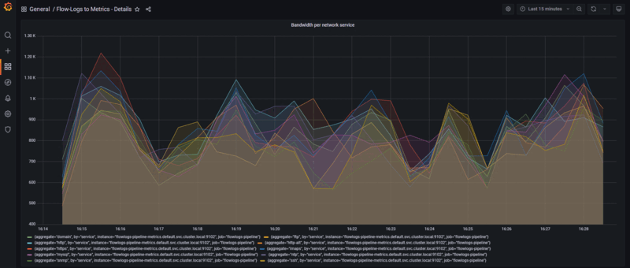
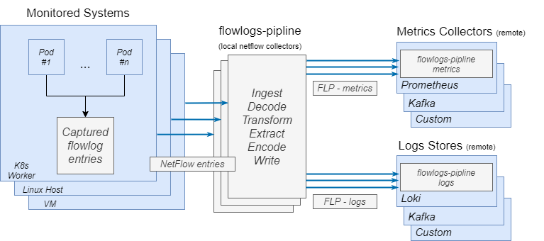

[](https://github.com/netobserv/flowlogs-pipeline/actions/workflows/pull_request.yml)
[](https://github.com/netobserv/flowlogs-pipeline/actions/workflows/push_image.yml)
[](https://codecov.io/gh/netobserv/flowlogs-pipeline)
[](https://goreportcard.com/report/github.com/netobserv/flowlogs-pipeline)

# Overview

**Flow-Logs Pipeline** (a.k.a. FLP) is an **observability tool** that **[consumes](./pkg/pipeline/ingest/)** logs from various inputs, **[transform](./pkg//pipeline/transform/)** them and **[export](./pkg/pipeline/write/)** logs to **[loki](https://grafana.com/oss/loki/)** and / or time series metrics to **[prometheus](https://prometheus.io/)**.



FLP can consume:
- raw **network flow-logs** in their original format 
([NetFlow v5,v9](https://en.wikipedia.org/wiki/NetFlow) or [IPFIX](https://en.wikipedia.org/wiki/IP_Flow_Information_Export)) 
- [eBPF agent](https://github.com/netobserv/netobserv-ebpf-agent) flows in binary format (protobuf+GRPC)
- Kafka entries in JSON format
- A simple file

FLP decorates the metrics and the transformed logs with **context**, 
allowing visualization layers and analytics frameworks to present **network insights** to SRE’s, cloud operators and network experts.

It also allows defining mathematical transformations to generate condense metrics that encapsulate network domain knowledge.

FLP pipeline module is built on top of [gopipes](https://github.com/netobserv/gopipes) providing customizability and parallelism

In addition, along with Prometheus and its ecosystem tools such as Thanos, Cortex etc., 
FLP provides an efficient scalable multi-cloud solution for comprehensive network analytics that can rely **solely on metrics data-source**.

Default network metrics are documented here [docs/metrics.md](docs/metrics.md).  
Operational metrics are documented here [docs/operational-metrics.md](docs/operational-metrics.md).

> note: operational metrics are exported only using prometheus   
<br>
<br>

> Note: prometheus eco-system tools such as Alert Manager can be used with FLP to generate alerts and provide big-picture insights.




# Usage

<!---AUTO-flowlogs-pipeline_help--->
```bash
Transform, persist and expose flow-logs as network metrics  
  
Usage:  
  flowlogs-pipeline [flags]  
  
Flags:  
      --config string            config file (default is $HOME/.flowlogs-pipeline)  
      --health.address string    Health server address (default "0.0.0.0")  
      --health.port string       Health server port (default "8080")  
  -h, --help                     help for flowlogs-pipeline  
      --log-level string         Log level: debug, info, warning, error (default "error")  
      --metricsSettings string   json for global metrics settings  
      --parameters string        json of config file parameters field  
      --pipeline string          json of config file pipeline field  
      --profile.port int         Go pprof tool port (default: disabled)
```
<!---END-AUTO-flowlogs-pipeline_help--->

> Note: for API details refer to [docs/api.md](docs/api.md).
> 
## Configuration generation

flowlogs-pipeline network metrics configuration ( `--config` flag) can be generated automatically using 
the `confGenerator` utility. `confGenerator` aggregates information from multiple user provided network *metric 
definitions* into flowlogs-pipeline configuration. More details on `confGenerator` can be found 
in [docs/confGenrator.md](docs/confGenerator.md).
 
To generate flowlogs-pipeline configuration execute:  
```shell
make generate-configuration
make dashboards
```

## Deploy into OpenShift (OCP) with prometheus, loki and grafana
To deploy FLP on OCP perform the following steps:
1. Verify that `kubectl` works with the OCP cluster
```shell
kubectl get namespace openshift
```
2. Deploy FLP with all dependent components (into `default` namespace)
```shell
kubectl config set-context --current --namespace=default
IMAGE_ORG=netobserv make ocp-deploy
```

3. Use a web-browser to access grafana dashboards ( end-point address exposed by the script) and observe metrics and logs  

## Deploy with Kind and netflow-simulator (for development and exploration)
These instructions apply for deploying FLP development and exploration environment with [kind](https://kind.sigs.k8s.io/) and [netflow-simulator](https://hub.docker.com/r/networkstatic/nflow-generator),
tested on Ubuntu 20.4 and Fedora 34.
1. Make sure the following commands are installed and can be run from the current shell:
   - make
   - go (version 1.19)
   - docker
2. To deploy the full simulated environment which includes a kind cluster with FLP, Prometheus, Grafana, and
   netflow-simulator, run (note that depending on your user permissions, you may have to run this command under sudo):
    ```shell
    make local-deploy
    ````
   If the command is successful, the metrics will get generated and can be observed by running (note that depending
   on your user permissions, you may have to run this command under sudo):
    ```shell
    kubectl logs -l app=flowlogs-pipeline -f
    ```
    The metrics you see upon deployment are default and can be modified through configuration described [later](#Configuration).

# Technology

FLP is a framework. The main FLP object is the **pipeline**. FLP **pipeline** can be configured (see
[Configuration section](#Configuration)) to extract the flow-log records from a source in a standard format such as NetFLow or IPFIX, apply custom processing, and output the result as metrics (e.g., in Prometheus format).

# Architecture

The pipeline is constructed of a sequence of stages. Each stage is classified into one of the following types:
- **ingest** - obtain flows from some source, one entry per line
- **transform** - convert entries into a standard format; can include multiple transform stages
- **write** - provide the means to write the data to some target, e.g. loki, standard output, etc
- **extract** - derive a set of metrics from the imported flows
- **encode** - make the data available in appropriate format (e.g. prometheus)

The first stage in a pipeline must be an **ingest** stage.
Each stage (other than an **ingest** stage) specifies the stage it follows.
Multiple stages may follow from a particular stage, thus allowing the same data to be consumed by multiple parallel pipelines.
For example, multiple **transform** stages may be performed and the results may be output to different targets.

A configuration file consists of two sections.
The first section describes the high-level flow of information between the stages, giving each stage a name and building the graph of consumption and production of information between stages.
The second section provides the definition of specific configuration parameters for each one of the named stages.
A full configuration file with the data consumed by  two different transforms might look like the following.

```yaml
pipeline:
  - name: ingest1
  - name: generic1
    follows: ingest1
  - name: write1
    follows: generic1
  - name: generic2
    follows: ingest1
  - name: write2
    follows: generic2
parameters:
  - name: ingest1
    ingest:
      type: file_loop
      file:
        filename: hack/examples/ocp-ipfix-flowlogs.json
        decoder:
          type: json
  - name: generic1
    transform:
      type: generic
      generic:
        policy: replace_keys
        rules:
          - input: Bytes
            output: v1_bytes
          - input: DstAddr
            output: v1_dstAddr
          - input: Packets
            output: v1_packets
          - input: SrcPort
            output: v1_srcPort
  - name: write1
    write:
      type: stdout
  - name: generic2
    transform:
      type: generic
      generic:
        policy: replace_keys
        rules:
          - input: Bytes
            output: v2_bytes
          - input: DstAddr
            output: v2_dstAddr
          - input: Packets
            output: v2_packets
          - input: SrcPort
            output: v2_srcPort
  - name: write2
    write:
      type: stdout
```
It is expected that the **ingest** module will receive flows every so often, and this ingestion event will then trigger the rest of the pipeline. So, it is the responsibility of the **ingest** module to provide the timing of when (and how often) the pipeline will run.

# Configuration

It is possible to configure flowlogs-pipeline using command-line-parameters, configuration file, or any combination of those options.


For example:
1. Using configuration file:

```yaml
log-level: info
pipeline:
  - name: ingest_file
  - name: write_stdout
    follows: ingest_file
parameters:
  - name: ingest_file
    ingest:
      type: file
      file:
        filename: hack/examples/ocp-ipfix-flowlogs.json
        decoder:
          type: json
  - name: write_stdout
    write:
      type: stdout
```
- execute


`./flowlogs-pipeline --config <configFile>`

2. Using command line parameters:
 
`./flowlogs-pipeline --pipeline "[{\"name\":\"ingest1\"},{\"follows\":\"ingest1\",\"name\":\"write1\"}]" --parameters "[{\"ingest\":{\"file\":{\"filename\":\"hack/examples/ocp-ipfix-flowlogs.json\"},\"decoder\":{\"type\":\"json\"},\"type\":\"file\"},\"name\":\"ingest1\"},{\"name\":\"write1\",\"write\":{\"type\":\"stdout\"}}]"`

Options included in the command line override the options specified in the config file.

`flowlogs-pipeline --log-level debug --pipeline "[{\"name\":\"ingest1\"},{\"follows\":\"ingest1\",\"name\":\"write1\"}]" --config <configFile>`

3. TODO: environment variables

Supported options are provided by running:

```
flowlogs-pipeline --help
```

# Syntax of portions of the configuration file

## Supported stage types

### Transform
Different types of inputs come with different sets of keys.
The transform stage allows changing the names of the keys and deriving new keys from old ones.
Multiple transforms may be specified, and they are applied in the **order of specification** (using the **follows** keyword).
The output from one transform becomes the input to the next transform.

### Transform Generic

The generic transform module maps the input json keys into another set of keys.
This allows to perform subsequent operations using a uniform set of keys.
In some use cases, only a subset of the provided fields are required.
Using the generic transform, we may specify those particular fields that interest us.
Specify `policy: replace_keys` to use only the newly specified keys.
To include the original keys and values in addition to those specified in the `rules`,
specify `policy: preserve_original_keys`.

The rule `multiplier` takes the input field, multiplies it by the provided value, and
places the result in the output field.
This is useful to use when provided with only a sample of the flow logs (e.g. 1 our of 20),
and some of the variables need to be adjusted accordingly.
If `multipier` is not set or if it is set to 0, then the input field is simply copied to the output field.

For example, suppose we have a flow log with the following syntax:
```
{"Bytes":20800,"DstAddr":"10.130.2.2","DstPort":36936,"Packets":400,"Proto":6,"SequenceNum":1919,"SrcAddr":"10.130.2.13","SrcHostIP":"10.0.197.206","SrcPort":3100,"TCPFlags":0,"TimeFlowStart":0,"TimeReceived":1637501832}
```

Suppose further that we are only interested in fields with source/destination addresses and ports, together with bytes and packets transferred.
The yaml specification for these parameters would look like this:

```yaml
parameters:
  - name: transform1
    transform:
      type: generic
      generic:
        policy: replace_keys
        rules:
          - input: Bytes
            output: bytes
            multiplier: 20
          - input: DstAddr
            output: dstAddr
          - input: DstPort
            output: dstPort
          - input: Packets
            output: packets
            multiplier: 20
          - input: SrcAddr
            output: srcAddr
          - input: SrcPort
            output: srcPort
          - input: TimeReceived
            output: timestamp
```

Each field specified by `input` is translated into a field specified by the corresponding `output`.
Only those specified fields are saved for further processing in the pipeline.
Further stages in the pipeline should use these new field names.
This mechanism allows us to translate from any flow-log layout to a standard set of field names.

In the above example, the `bytes` and `packets` fields have a multiplier of 20.
This may be done in case only a sampling of the flow logs are provided, in this case 1 in 20,
so that these fields need to be scaled accordingly.

If the `input` and `output` fields are identical, then that field is simply passed to the next stage.
For example:
```yaml
pipeline:
  - name: transform1
    follows: <something>
  - name: transform2
    follows: transform1
parameters:
  - name: transform1
    transform:
      type: generic
      generic:
        policy: replace_keys
        rules:
          - input: DstAddr
            output: dstAddr
          - input: SrcAddr
            output: srcAddr
  - name: transform2
    transform:
      type: generic
      generic:
        policy: replace_keys
        rules:
          - input: dstAddr
            output: dstIP
          - input: dstAddr
            output: dstAddr
          - input: srcAddr
            output: srcIP
          - input: srcAddr
            output: srcAddr
```
Before the first transform suppose we have the keys `DstAddr` and `SrcAddr`.
After the first transform, we have the keys `dstAddr` and `srcAddr`.
After the second transform, we have the keys `dstAddr`, `dstIP`, `srcAddr`, and `srcIP`.

To maintain all the old keys and values and simply add the key `dstAddr` (derived from `DstAddr`), use the following:
```yaml
parameters:
  - name: transform1
    transform:
      type: generic
      generic:
        policy: preserve_original_keys
        rules:
          - input: DstAddr
            output: dstAddr
```

### Transform Filter

The filter transform module allows setting rules to remove complete entries from
the output, or just remove specific keys and values from entries.

For example, suppose we have a flow log with the following syntax:
```json
{"Bytes":20800,"DstAddr":"10.130.2.2","DstPort":36936,"Packets":400,"Proto":6,"SequenceNum":1919,"SrcAddr":"10.130.2.13","SrcHostIP":"10.0.197.206","SrcPort":3100,"TCPFlags":0,"TimeFlowStart":0,"TimeReceived":1637501832}
```

The below configuration will remove (filter) the entry from the output

```yaml
pipeline:
  transform:
    - type: filter
      filter:
        rules:
        - input: SrcPort
          type: remove_entry_if_exists 
```
Using `remove_entry_if_doesnt_exist` in the rule reverses the logic and will not remove the above example entry
Using `remove_field` in the rule `type` instead, results in outputting the entry after
removal of only the `SrcPort` key and value 
Using `remove_entry_if_equal` will remove the entry if the specified field exists and is equal to the specified value.
Using `remove_entry_if_not_equal` will remove the entry if the specified field exists and is not equal to the specified value.

### Transform Network

`transform network` provides specific functionality that is useful for transformation of network flow-logs:

1. Resolve subnet from IP addresses
1. Resolve known network service names from port numbers and protocols
1. Compute geo-location from IP addresses
1. Resolve kubernetes information from IP addresses

Example configuration:

```yaml
parameters:
  - name: transform1
    transform:
      type: network
      network:
        KubeConfigPath: /tmp/config
        rules:
          - input: srcIP
            output: srcSubnet
            type: add_subnet
            parameters: /24
          - input: dstPort
            output: service
            type: add_service
            parameters: protocol
          - input: dstIP
            output: dstLocation
            type: add_location
          - input: srcIP
            output: srcK8S
            type: add_kubernetes
```

The rule `add_subnet` generates a new field named `srcSubnet` with the 
subnet of `srcIP` calculated based on prefix length from the `parameters` field 

The rule `add_service` generates a new field named `service` with the known network 
service name of `dstPort` port and `protocol` protocol. Unrecognized ports are ignored 
> Note: `protocol` can be either network protocol name or number  
>   
> Note: optionally supports custom network services resolution by defining configuration parameters 
> `servicesFile` and `protocolsFile` with paths to custom services/protocols files respectively  

The rule `add_location` generates new fields with the geo-location information retrieved 
from DB [ip2location](https://lite.ip2location.com/) based on `dstIP` IP. 
All the geo-location fields will be named by appending `output` value 
(`dstLocation` in the example above) to their names in the [ip2location](https://lite.ip2location.com/ DB 
(e.g., `CountryName`, `CountryLongName`, `RegionName`, `CityName` , `Longitude` and `Latitude`)

The rule `add_kubernetes` generates new fields with kubernetes information by
matching the `input` value (`srcIP` in the example above) with kubernetes `nodes`, `pods` and `services` IPs.
All the kubernetes fields will be named by appending `output` value
(`srcK8S` in the example above) to the kubernetes metadata field names
(e.g., `Namespace`, `Name`, `Type`, `HostIP`, `OwnerName`, `OwnerType` )

In addition, if the `parameters` value is not empty, fields with kubernetes labels 
will be generated, and named by appending `parameters` value to the label keys.   

> Note: kubernetes connection is done using the first available method: 
> 1. configuration parameter `KubeConfigPath` (in the example above `/tmp/config`) or
> 2. using `KUBECONFIG` environment variable
> 3. using local `~/.kube/config`

> Note: above example describes the most common available transform network `Type` options

> Note: above transform is essential for the `aggregation` phase  

### Aggregates

Aggregates are used to define the transformation of flow-logs from textual/json format into
numeric values to be exported as metrics. Aggregates are dynamically created based
on defined values from fields in the flow-logs and on mathematical functions to be performed
on these values.
The specification of the aggregates details is placed in the `extract` stage of the pipeline.

For Example, assuming set of flow-logs, with single sample flow-log that looks like:
```
{"srcIP":   "10.0.0.1",
"dstIP":   "20.0.0.2",
"level":   "error",
"value":   "7",
"message": "test message"}
```

It is possible to define aggregates per `srcIP` or per `dstIP` of per the tuple `srcIP`x`dstIP`
to capture the `sum`, `min`, `avg` etc. of the values in the field `value`.

For example, configuration record for aggregating field `value` as
average for `srcIP`x`dstIP` tuples will look like this:

```yaml
pipeline:
  - name: aggregate1
    follows: <something>
parameters:
  - name: aggregate1
    extract:
      type: aggregates
      aggregates:
        - name: "Average key=value for (srcIP, dstIP) pairs"
          by:
            - "dstIP"
            - "srcIP"
          operation: "avg"
          operationKey: "value"
```

The output fields of the aggregates stage are:
- `name`
- `operation`
- `operation_key`
- `by`
- `aggregate`
- `total_value`: the total aggregate value
- `total_count`: the total count
- `recent_raw_values`: a slice with the raw values of the recent batch
- `recent_op_value`: the aggregate value of the recent batch
- `recent_count`: the count of flowlogs in the recent batch

These fields are used by the next stage (for example `prom` encoder).
The pipeline processes flowlogs in batches.
The output fields with `recent_` prefix are related to the recent batch.
They are needed when exposing metrics in Prometheus using Counters and Histograms.
Prometheus Counters API accepts the delta amount to be added to the counter and not the total value as in Gauges.
In this case, `recent_op_value` and `recent_count` should be used as the `valueKey`.
The API of Histograms accepts the sample value, so it could be added to the appropriate bucket.
In this case, we are interested in the raw values of the records in the aggregation group.
No aggregate operation is needed and it should be set `raw_values`. The `valueKey` should be set to `recent_raw_values`.

**Note**: `recent_raw_values` is filled only when the operation is `raw_values`.

### Connection tracking

The connection tracking module allows grouping flow logs with common properties (i.e. same connection) and calculate 
useful statistics.
The input of the module is flow-log records and the output is connection records and the flow-log records with an
additional hash id field to correlate with the connection records.
There are 4  output records types:
1. **New connection**: indicates that a new connection is detected. i.e. the input contains a flow-log that doesn't
belong to any of the tracked connections.
2. **Heartbeat**: a periodic report of the connection statistics for long connections.
3. **End connection**: indicates that a connection has ended. A connection is considered ended once the 
timeout since the latest flow-log of the connection has elapsed or a flow log of `FIN_ACK` has been received.
4. **Flow log**: a copy of the input flow log with the additional `_RecordType` and `_HashId` fields.

The configuration can suppress any of the output types.

The configuration of the module allows defining how to group flow-logs into connections.
There is an option to group flow-logs into unidirectional connections or bidirectional connections.
The difference is that in unidirectional setting, flow-logs from A to B are grouped separately from flow-logs from B to A.
While, in bidirectional setting, they are grouped together.

Bidirectional setting requires defining both `fieldGroupARef` and `fieldGroupBRef` sections to allow the connection
tracking module to identify which set of fields can swap values and still be considered as the same connection.
The pairs of fields that can swap are determined by their order in the fieldGroup.
In the example below, `SrcAddr` and `DstAddr` are first in their fieldGroup, so they are swappable.
The same is true for `SrcPort` and `DstPort` which are second.

The configuration example below defines a bidirectional setting. So flow-logs that have the values of `SrcAddr` and `SrcPort` 
swapped with `DstAddr` and `DstPort` are grouped together as long as they have the same `Proto` field.
For example, the following first 2 flow-logs are grouped together into the same connection.
While the third flow-log forms a new connection (because its `Proto` field differs from the first 2).
```json
{"SrcAddr":"10.0.0.1", "SrcPort":1234, "DstAddr":"10.0.0.2", "DstPort":80, "Proto":6, "Bytes":100, "TimeReceived": 1661430100}
{"SrcAddr":"10.0.0.2", "SrcPort":80, "DstAddr":"10.0.0.1", "DstPort":1234, "Proto":6, "Bytes":200, "TimeReceived": 1661430200}
{"SrcAddr":"10.0.0.1", "SrcPort":1234, "DstAddr":"10.0.0.2", "DstPort":80, "Proto":17, "Bytes":300, "TimeReceived": 1661430300}
```

A typical configuration might look like:
```yaml
parameters:
- name: extract_conntrack
  extract:
    type: conntrack
    conntrack:
      keyDefinition:
        fieldGroups:
        - name: src
          fields:
          - SrcAddr
          - SrcPort
        - name: dst
          fields:
          - DstAddr
          - DstPort
        - name: protocol
          fields:
          - Proto
        hash:
          fieldGroupRefs:
          - protocol
          fieldGroupARef: src
          fieldGroupBRef: dst
      outputRecordTypes:
      - newConnection
      - endConnection
      - heartbeat
      - flowLog
      outputFields:
      - name: Bytes_total
        operation: sum
        input: Bytes
      - name: Bytes
        operation: sum
        splitAB: true
      - name: numFlowLogs
        operation: count
      - name: TimeFlowStart
        operation: min
        input: TimeReceived
      - name: TimeFlowEnd
        operation: max
        input: TimeReceived
      scheduling:
      - selector: # UDP connections
          Proto: 17
        endConnectionTimeout: 5s
        heartbeatInterval: 40s
        terminatingTimeout: 5s
      - selector: {} # Default group
        endConnectionTimeout: 10s
        heartbeatInterval: 30s
        terminatingTimeout: 5s
      tcpFlags:
        fieldName: Flags
        detectEndConnection: true
        swapAB: true
```

A possible output would look like:
```json
{
    "_RecordType": "endConnection",
    "_HashId": "3e8ba98164baecaf",
    "_IsFirst": true,
    "SrcAddr": "10.0.0.1",
    "SrcPort": 1234,
    "DstAddr": "10.0.0.2",
    "DstPort": 80,
    "Proto": 6,
    "Bytes_AB": 100,
    "Bytes_BA": 200,
    "Bytes_total": 300,
    "numFlowLogs": 2,
    "TimeFlowStart": 1661430100,
    "TimeFlowEnd": 1661430200
}

{
    "_RecordType": "flowLog",
    "_HashId": "bca4c313a1ad1b1c",
    "SrcAddr": "10.0.0.1",
    "SrcPort": 1234,
    "DstAddr": "10.0.0.2",
    "DstPort": 80,
    "Proto": 17,
    "Bytes": 300,
    "TimeReceived": 1661430300
}
```
#### Connection tracking metrics

The following table shows the possible values of the `classification` label in `conntrack_input_records` operational metric.

| Metric          | Reason                                                                                     |
|-----------------|--------------------------------------------------------------------------------------------|
 | `discarded`     | layer2 protocols like ARP, none transport protocols like ICMPv4/6 and too many connections |
 | `rejected`      | when Error happens calculating connection track hash                                       |
 | `duplicate`     | for duplicate flows                                                                        |
 | `newConnection` | when new connection tracking flow is created                                               |

Notice that all output records contain `_RecordType` and `_HashId` fields.
Output fields that set `splitAB: true` (like in `Bytes`) are split into 2 fields `Bytes_AB` and `Bytes_BA` which 
aggregate values separately based on direction A->B and B->A respectively.
When `splitAB` is absent, its default value is `false`.

The boolean field `_IsFirst` exists only in records of type `newConnection`, `heartbeat` and `endConnection`.
It is set to true only on the first record of the connection.
The `_IsFirst` field is useful in cases where `newConnection` records are not outputted (to reduce the number output records)
and there is a need to count the total number of connections: simply counting `_IsFirst=true` 

The configuration allows defining scheduling groups. That is, defining different timeouts based on connection key fields' values.
The order of the defined groups is important since the group of a connection is determined by the first matching group.
The last group must have an empty selector indicating a match-all rule serving as a default group for connections that 
don't match any of the other groups. There can't be more than one default group.

The TCP flags section in the configuration allows utilizing the TCP flags data collected in the flow logs.
It has the following features that could be enabled (by default, they aren't enabled):
1. Ending connections when the `FIN_ACK` flag is set and avoid waiting the `EndConnectionTimeout`.
2. Swapping source and destination of a connection when `SYN_ACK` is set on the first flow log.
The source and destination of a connection are determined by the first received flow log of the connection.
If the first received flow log happens to be of the opposite direction (server -> client) either because of sampling or out of order,
then the source and destination of the connection are swapped.
In special cases, where the first received flow log has the `SYN_ACK` flag,
we can assume that it is the second step of the TCP handshake,
the direction is from the server (source) to the client (destination) and we can swap them in the connection so the client will be the source and the server will be the destination.  


### Timebased TopK

It is sometimes desirable to return only a subset of records, such as those connections that use the most bandwidth.
This information is often relevant only for recently reported records.
This stage enables the reporting of records for the top (or bottom) K entries that have recently been processed.
The specification of the Timebased TopK details is placed in the `extract` stage of the pipeline.

For Example, assuming a set of flow-logs, with a single sample flow-log that looks like:
```
{
    "srcIP": "10.0.0.1",
    "dstIP":  "20.0.0.2",
    "srcSubnet": "10.0.0.0/16",
    "bytes":  4096,
}
```

It is possible to request the entries indexed by subnet with the top number of bytes.
There may be multiple records with the same index (e.g. same srcIP or same subnet, as the case may be).
The time interval over which to select the TopK may be specified.
It may further be specified what operation to perform on the multiple entries of the same index that fall within the allowed time inerval.
The allowed operations are: `sum`, `min`, `max`, `avg`, `diff`, `last`.
To obtain the bottom K entries instead of the Top K entries, set `reversed` to `true`.

A sample configuration record looks like this:

```yaml
pipeline:
  - name: timebased1
    follows: <something>
parameters:
  - name: timebased1
    extract:
      type: timebased
      timebased:
        rules:
          - name: "Top 3 Sum of bytes per source subnet over last 10 seconds"
            operation: sum
            operationKey: bytes
            recordKeys: srcSubnet
            topK: 3
            reversed: false
            timeInterval: 10s
```

The output fields of the aggregates stage are:
- `name`; the name of the rule.
- `index_key`; the fields specified in the rules upon which to index, comma separated. Each of these keys will be append in the output with their corresponding values.
- `operation`; the operation of the rule. The result value of the operation is append in `operationKey` output field.

Example output:
```json
{
   "name":"Top 3 Sum of bytes per source subnet over last 10 seconds",
   "index_key":"srcSubnet",
   "operation":"sum",
   "srcSubnet":"10.0.0.0/16",
   "bytes":1234,
}
```

These fields are used by the next stage (for example `prom` encoder).

### Prometheus encoder

The prometheus encoder specifies which metrics to export to prometheus and which labels should be associated with those metrics.
For example, we may want to report the number of bytes and packets for the reported flows.
For each reported metric, we may specify a different set of labels.
Each metric may be renamed from its internal name.
The internal metric name is specified as `valueKey` and the exported name is specified as `name`.
A prefix for all exported metrics may be specified, and this prefix is prepended to the `name` of each specified metric.

```yaml
parameters:
  - name: prom1
    encode:
      type: prom
      prom:
        prefix: test_
        metrics:
          - name: Bytes
            type: gauge
            valueKey: bytes
            labels:
              - srcAddr
              - dstAddr
              - srcPort
          - name: Packets
            type: counter
            valueKey: packets
            labels:
              - srcAddr
              - dstAddr
              - dstPort
```

In this example, for the `bytes` metric we report with the labels which specify srcAddr, dstAddr and srcPort.
Each different combination of label-values is a distinct gauge reported to prometheus.
The name of the prometheus gauge is set to `test_Bytes` by concatenating the prefix with the metric name.
The `packets` metric is very similar. It makes use of the `counter` prometheus type which adds reported values
to a prometheus counter.

### Loki writer

The loki writer persists flow-logs into [Loki](https://github.com/grafana/loki). The flow-logs are sent with defined 
tenant ID and with a set of static labels and dynamic labels from the record fields. 
For example, sending flow-logs into tenant `theTenant` with labels 
from `foo` and `bar` fields 
and including static label with key `job` with value `flowlogs-pipeline`. 
Additional parameters such as `url` and `batchWait` are defined in 
Loki writer API [docs/api.md](docs/api.md)

```yaml
parameters:
  - name: write_loki
    write:
      type: loki
      loki:
        tenantID: theTenant
        url: http://loki.default.svc.cluster.local:3100
        staticLabels:
          job: flowlogs-pipeline
        batchWait: 1m
        labels:
          - foo
          - bar
  ```

> Note: to view loki flow-logs in `grafana`: Use the `Explore` tab and choose the `loki` datasource. In the `Log Browser` enter `{job="flowlogs-pipeline"}` and press `Run query` 

### Object Store encoder

The object store encoder allows to export flows into an object store using the S3 API.
A batch of flow logs received in some time interval are collected and stored in a single object.
The configuration provides the URL of the object store, credentials to access the object store, the bucket in the object store into which the objects should be placed, and parameters (key/value pairs) to be stored as metadata of the created objects.
Object names are constructed according to the following format:
```
<bucket>/<account>/year={xxxx}/month={yy}/day={zz}/hour={hh}/stream-id={stream-id}/{sequence-number}
```

The `{stream-id}` is derived from the time flowlogs-pipeline started to run.
The syntax of a sample configuration file is as follows:

```
parameters:
  - name: encodeS3
    encode:
      type: s3
      s3:
        endpoint: 1.2.3.4:9000
        bucket: bucket1
        account: account1
        accessKeyId: accessKey1
        secretAccessKey: secretAccessKey1
        writeTimeout: 60s
        batchSize: 100
        objectHeaderParameters:
          key1: val1
          key2: val2
          key3: val3
          key4: val4
```

The key/value pairs in `objectHeaderParameters` may contain arbitrary configuration information that the administrator wants to save as metadata for the produced objects, such as `tenant_id` or `network_interface_id`.
The content of the object consists of object header fields followed by the actual flow logs.
The object header contains the following fields: `version`, `capture_start_time`, `capture_end_time`, `number_of_flow_logs`, plus all the fields provided in the configuration under the `objectHeaderParameters`.

If no flow logs arrive within the `writeTimeout` period, then an object is created with no flows.
An object is created either when we have accumulated `batchSize` flow logs or when `writeTimeout` has passed.

### Metrics Settings

Some global metrics settings may be set in the configuration file.
A sample is the following:

```
metricsSettings:
  suppressGoMetrics: true
  prefix: flp_operational_
  port: 9102

```

FLP metrics are reported to a prometheus client interface.
In addition, there are default metrics reported by `Go`, which are also directed to the prometheus client interface.
The port to which these metrics are made available is specified in the `port` configuration parameter.
If a `prefix` is specified, then the specified prefix is prepended to each of the operational metrics generated by FLP.
A different `prefix` may be specified on an `encode prom` stage to be prepended to the prometheus metrics defined in that stage.
The `suppressGoMetrics` parameter may be set to `true` in order to suppress the reporting of the `Go` and process metrics in the prometheus client interface.

# Development

## Build

- Clone this repository from github into a local machine (Linux/X86):
  `git clone git@github.com:netobserv/flowlogs-pipeline.git`
- Change directory into flowlogs-pipeline into:
  `cd flowlogs-pipeline`
- Build the code:
  ```bash
  # compile project
  make build

  # build the default image (quay.io/netobserv/flowlogs-pipeline:latest):
  make image-build

  # push the default image (quay.io/netobserv/flowlogs-pipeline:latest):
  make image-push

  # build and push on your own quay.io account (quay.io/myuser/flowlogs-pipeline:dev):
  IMAGE_ORG=myuser VERSION=dev make images

  # build and push on a different registry
  IMAGE=dockerhub.io/myuser/plugin:tag make images
  ```

FLP uses `Makefile` to build, tests and deploy. Following is the output of `make help` :

<!---AUTO-makefile_help--->
```bash
  
Usage:  
  make <target>  
  
General  
  help                  Display this help.  
  vendors               Check go vendors  
  
Develop  
  lint                  Lint the code  
  build                 Build flowlogs-pipeline executable and update the docs  
  docs                  Update flowlogs-pipeline documentation  
  clean                 Clean  
  tests-unit            Unit tests  
  tests-fast            Fast unit tests (no race tests / coverage)  
  tests-e2e             End-to-end tests  
  tests-all             All tests  
  benchmarks            Benchmark  
  run                   Run  
  
Images  
  image-build           Build MULTIARCH_TARGETS images  
  image-push            Push MULTIARCH_TARGETS images  
  manifest-build        Build MULTIARCH_TARGETS manifest  
  manifest-push         Push MULTIARCH_TARGETS manifest  
  
kubernetes  
  deploy                Deploy the image  
  undeploy              Undeploy the image  
  deploy-loki           Deploy loki  
  undeploy-loki         Undeploy loki  
  deploy-prometheus     Deploy prometheus  
  undeploy-prometheus   Undeploy prometheus  
  deploy-grafana        Deploy grafana  
  undeploy-grafana      Undeploy grafana  
  deploy-netflow-simulator  Deploy netflow simulator  
  undeploy-netflow-simulator  Undeploy netflow simulator  
  
kind  
  create-kind-cluster   Create cluster  
  delete-kind-cluster   Delete cluster  
  kind-load-image       Load image to kind  
  
metrics  
  generate-configuration  Generate metrics configuration  
  
End2End  
  local-deploy          Deploy locally on kind (with simulated flowlogs)  
  local-cleanup         Undeploy from local kind  
  local-redeploy        Redeploy locally (on current kind)  
  ocp-deploy            Deploy to OCP  
  ocp-cleanup           Undeploy from OCP  
  dev-local-deploy      Deploy locally with simulated netflows  
  
shortcuts helpers  
  build-image           Build MULTIARCH_TARGETS images  
  push-image            Push MULTIARCH_TARGETS images  
  build-manifest        Build MULTIARCH_TARGETS manifest  
  push-manifest         Push MULTIARCH_TARGETS manifest  
  images                Build and push MULTIARCH_TARGETS images and related manifest
```
<!---END-AUTO-makefile_help--->
