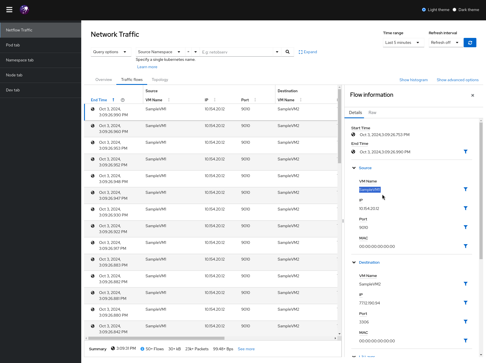

# Netflow / IPFIX capture hack

This hack allows netflows v5 / v9 capture and enrichment using the netobserv stack:
- flowlogs-pipeline for capture and enrichment
- grafana loki as storage
- [console plugin](https://github.com/netobserv/network-observability-console-plugin) for UI
It rely on docker to run each component in separated containers.

Simply run the following command from the root directory:
```
make ipfix-capture
```

It will expose ingesters on ports `2055` for netflows v5 and `4739` for IPFIX.
Check [docker-ipfix-config.yaml](./examples/docker-ipfix-config.yaml) for full pipeline configuration.

Ensure that loki is correctly running using http://localhost:3100/ready endpoint. It should displat `ready`.

To simulate flows, you can rely on https://github.com/nerdalert/nflow-generator and run:
```
./nflow-generator -t localhost -p 2055
```

Once some flows are ingested, you will see these in the console logs:
```
{"AsPath":null,"BgpCommunities":null,"BgpNextHop":null,"BiFlowDirection":0,"Bytes":266,"CustomBytes_1":null,"CustomBytes_2":null,"CustomBytes_3":null,"CustomBytes_4":null,"CustomBytes_5":null,"CustomInteger_1":0,"CustomInteger_2":0,"CustomInteger_3":0,"CustomInteger_4":0,"CustomInteger_5":0,"CustomList_1":null,"DstAddr":"77.12.190.94","DstAs":64897,"DstMac":"00:00:00:00:00:00","DstNet":2,"DstPort":3306,"DstVM_Name":"SampleVM2","DstVlan":0,"EgressVrfId":0,"Etype":2048,"FlowDirection":0,"ForwardingStatus":0,"FragmentId":0,"FragmentOffset":0,"HasMpls":false,"IcmpCode":0,"IcmpType":0,"InIf":0,"IngressVrfId":0,"IpTos":0,"IpTtl":0,"Ipv6FlowLabel":0,"MplsCount":0,"MplsLabelIp":null,"MplsLastLabel":0,"MplsLastTtl":0,"Mpls_1Label":0,"Mpls_1Ttl":0,"Mpls_2Label":0,"Mpls_2Ttl":0,"Mpls_3Label":0,"Mpls_3Ttl":0,"NextHop":"lhSRAQ==","NextHopAs":0,"ObservationDomainId":0,"ObservationPointId":0,"OutIf":0,"Packets":944,"Proto":6,"SamplerAddress":"fwAAAQ==","SamplingRate":0,"SequenceNum":20362,"SrcAddr":"10.154.20.12","SrcAs":42566,"SrcMac":"00:00:00:00:00:00","SrcNet":12,"SrcPort":9010,"SrcVM_Name":"SampleVM1","SrcVlan":0,"TcpFlags":0,"TimeFlowEnd":1727959922,"TimeFlowEndMs":1727959921619,"TimeFlowStart":1727959922,"TimeFlowStartMs":1727959921518,"TimeReceived":1727959923,"Type":2,"VlanId":0,"_HashId":"e6fa4e3255330028","_RecordType":"flowLog"}
```

Once some logs are ingested, you can open the console UI using `http://localhost:9001/` and open `Netflow Traffic` page.



To end the capture, press `CTRL + C` at anytime. It will destroy all the created containers.
